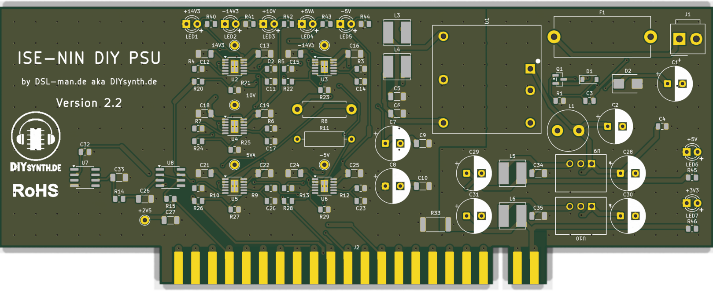
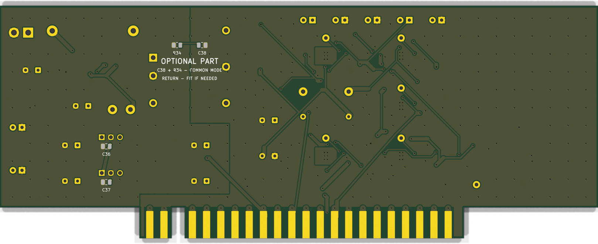

# ISE-NIN Low-Noise Power Supply — MK2

A replacement internal power supply card for the **Black Corporation ISE-NIN**,
an eight-voice analogue polysynth in the tradition of the Roland Jupiter-8.

It is a drop-in: same 167 × 65 mm plug-in card, same backplane slot, same
edge-connector pinout, same single 12 V feed. Everything changes behind that.

**This is not a repair.** The factory board works. The point is a much quieter
analogue supply and a precision reference for the VCO chips.

---

## Why bother

The stock board — silkscreened *DIY POWER BOARD MK1.0* — derives eight rails
from one 12 V input. Three of them matter more than the rest:

* **±15 V** comes straight off an isolated DC/DC module. The module is specified
  at **100 mV pp of ripple and noise** at roughly 330 kHz, and behind it sit only
  100 µF and 0.1 µF. That ripple lands on eight analogue voice cards unfiltered.
* **+2.5 V is not a housekeeping rail.** It is the `VREF` *input* of the sixteen
  SSI2131 oscillator chips, and through the expo-scale current it sets the
  sensitivity of the exponential converter and the level of every waveform
  output. The factory board makes it with a TL431 shunt reference, whose drift
  is in the same league as the 200 ppm/°C scale-factor drift of the oscillator
  chip itself.
* **The 1 A fuse carries 1.21 A** — 121 % of its rating, continuously.

There is also no reverse-polarity protection. The 1N5817 on the board is the
freewheeling diode of the 3.3 V buck, not an input protection.

---

## Key facts against the original board

| | Original MK1.0 | MK2 |
|---|---|---|
| ±15 V analogue rails | DC/DC module output, direct | **±14.3 V** from an LT3045 / LT3094 behind an LC filter |
| Ripple on those rails | ~100 mV pp at 330 kHz (module spec, unfiltered) | the regulator's own noise, **2.5 / 3 µV RMS** (design figure, see below) |
| +10 V (multiplexer VDD) | 7810 linear | LT3045 |
| +5 VA (SSI2131 V+) | 7805 linear | LT3045, tight tolerance, monotonic start-up |
| −5 V (SSI2131 V−) | 7905 linear | LT3094 |
| **+2.5 V (SSI2131 VREF)** | TL431 shunt reference | **ADR4525**, 2 ppm/°C, with a precision op-amp buffer — the arrangement the SSI2131 datasheet asks for |
| +5 V / +3.3 V digital | switching regulators off the raw DC | unchanged in principle, own pi filters added |
| Reverse-polarity protection | none | ideal-diode P-MOSFET |
| Inrush current | unlimited | limited to **0.53 A** by the same MOSFET's gate capacitor |
| Input fuse | 1 A, carrying 121 % of rating | **2 A**, carrying 55 % |
| Heat | three TO-220 regulators with heatsinks | **no heatsinks**, no part above 0.6 W, 3.6 W total |
| Rail monitoring | none | seven power-good LEDs, one per rail |
| Layers | — | 4 |
| Measured draw at 12 V | **1.21 A / 14.5 W** | **1.10 A / 13.2 W** |

The ±14.3 V rather than ±15.0 V is a consequence of the dual-output converter
module having no trim pin. For supply rails this is uncritical — the references
that set pitch and level hang on +10 V and +2.5 V, which are generated on the
card and unaffected.

### Measured rail currents

With all eight voice cards fitted and running:

| Rail | Current |
|---|---:|
| +14.3 V | 318 mA |
| −14.3 V | ~194 mA |
| +10 V | 11.3 mA |
| +5 VA | 58.3 mA |
| −5 V | 65 mA |

Rails sit at +14.234 V and −14.222 V. The converter module delivers about 9.9 W
of its 30 W, so there is a lot of headroom — the design is limited by noise
targets, not by power.

---

## Ripple and noise

These are **design and datasheet figures, not measurements.** The board has been
built and the DC conditions measured; the noise floor has not yet been captured
with an instrument. Treat the last line as a target, not a result.

| Stage | Figure | Where it comes from |
|---|---|---|
| DC/DC module, Traco THN 30-2423WIR | 100 mV pp ripple & noise, switching at 290–370 kHz (330 kHz typ.) | datasheet |
| Output LC filter, 10 µH + 110 µF per rail, fc = 4.8 kHz | second order, 40 dB/decade → **≈73 dB** at 330 kHz, so ≈22 µV pp reaches the regulator | calculated |
| LT3045 / LT3094 ripple rejection | **>70 dB** at that frequency | datasheet |
| What is left on the rail | the regulator's own noise: **2.5 µV RMS** (LT3045) / **3 µV RMS** (LT3094), 10 Hz–100 kHz | datasheet, for the 0.47 µF SET capacitor actually fitted |

Two details in there are deliberate and easy to get wrong:

**The LC filter is damped on purpose.** Characteristic impedance is
√(L/C) = √(10 µH / 110 µF) = 0.30 Ω. A normal electrolytic with ~0.5 Ω ESR gives
Q ≈ 0.6, which is aperiodically damped. A low-ESR capacitor here would make the
filter ring on load steps. The ESR is part of the function, so the BOM asks for
a standard-ESR part explicitly.

**The SET capacitor is 0.47 µF, not 4.7 µF.** The larger value would put the
LT3045 at its 0.8 µV RMS noise floor instead of 2.5 µV. The smaller one was
chosen because the start-up time constant is proportional to RSET, so
the rails come up in a useful order all by themselves:

| Time | Rail | What it feeds |
|---:|---|---|
| 27 ms | +5 VA, −5 V | SSI2131 supplies, multiplexer VEE |
| 54 ms | +10 V | multiplexer VDD |
| 77 ms | ±14.3 V | the op-amps that drive signals into the multiplexers and oscillators |

Chips and multiplexer rails before op-amp rails — the same order the factory
board happens to have, but here it falls out of the dimensioning rather than out
of luck. No sequencing circuit is fitted.

Against the 100 mV pp that sit on those rails today, 2.5 µV RMS is still an
improvement of more than four orders of magnitude, and for supply rails feeding
op-amps with their own supply rejection the difference between 0.8 and 2.5 µV
has no practical meaning.

---

## Bill of materials — hand-soldered parts (Mouser)

The SMD parts are machine-assembled by the board house from their own library
and are not listed here. What follows is everything that goes on by hand: the
through-hole parts, plus two positions that are footprinted but deliberately
left unfitted.

Paste [`bom/mouser-bom.csv`](bom/mouser-bom.csv) straight into Mouser's BOM tool.

| Mouser Part No | Qty | Manufacturer Part No | Description | Designators | Note |
|---|---:|---|---|---|---|
| `667-EEU-FM1E221` | 2 | `EEU-FM1E221` | 220 uF / 25 V aluminium electrolytic, low impedance | C1, C2 | Panasonic FM. Input smoothing. |
| `647-UBW1E101MPD` | 6 | `UBW1E101MPD` | 100 uF / 25 V aluminium electrolytic, standard ESR | C7, C8, C28, C29, C30, C31 | Nichicon BW. Deliberately NOT low-ESR - the ESR damps the output LC filter. |
| `80-C0805C473K1R` | 1 | `C0805C473K1RACTU` | 47 nF / 100 V X7R, 0805 | C38 | Optional, not fitted. Common-mode path. |
| `576-0218002.MXP` | 1 | `0218002.MXP` | 2 A slow-blow fuse, 5 x 20 mm | F1 | Littelfuse 218 series. |
| `576-00BS0232P` | 1 | `00BS0232P` | Fuse holder cover | F1 (cover) | Littelfuse. Fits the 0PTF0078P. |
| `576-0PTF0078P` | 1 | `0PTF0078P` | Fuse holder, 5 x 20 mm, open, horizontal | F1 (holder) | Littelfuse PTF series, PCB mount. |
| `571-6404452` | 1 | `640445-2` | MTA-156 header, 2 pin | J1 | TE / AMP. 12 V input, plus left, ground right. |
| `652-RLB0913-100K` | 1 | `RLB0913-100K` | 10 uH / 3.1 A radial inductor | L1 | Bourns. Input pi filter with C1 and C2. |
| `604-WP710A10LID` | 7 | `WP710A10LID` | Red LED, T-1 (3 mm), low current, diffused | LED1, LED2, LED3, LED4, LED5, LED6, LED7 | Kingbright, 2 mA. One power-good indicator per rail. |
| `660-MOS1CT528R390J` | 1 | `MOS1CT528R390J` | 39 ohm / 1 W metal oxide, axial | R8 | KOA. Pre-drop ahead of the +5 VA regulator. |
| `71-WK202070C6809F220` | 1 | `WK202070C6809F2200` | 68 ohm / 1 W metal oxide, axial, 1 %, 50 ppm/K | R11 | Vishay WK2. Pre-drop ahead of the -5 V regulator. |
| `71-CRCW0805-1-E3` | 1 | `CRCW08051R00FKEA` | 1 ohm, 0805 | R34 | Optional, not fitted. Damping for C38. |
| `495-THN30-2423WIR` | 1 | `THN 30-2423WIR` | DC/DC converter, 30 W, isolated, +/-15 V out | U1 | Traco THN 30-2423WIR. The one part carried over from the original board. |
| `919-R-78E5.0-1.0` | 1 | `R-78E5.0-1.0` | Switching regulator, 5 V / 1 A, SIP-3 | U9 | Recom. Digital rail, straight off the raw 12 V. |
| `919-R-78E3.3-1.0` | 1 | `R-78E3.3-1.0` | Switching regulator, 3.3 V / 1 A, SIP-3 | U10 | Recom. Digital rail, straight off the raw 12 V. |

Two substitutions are worth knowing about, because the obvious parts are not
buyable:

* **The LEDs.** The `L-934LID` that the design started with is discontinued,
  non-RoHS, and Mouser will not ship it to the EU. `WP710A10LID` is the same
  house, same T-1 package, same 2 mA operating point — the series resistors are
  unchanged.
* **R8.** `MOS1CT52A39R0F` (1 %) is not carried by Mouser at all. The 5 %
  variant of the same KOA MOS1C is. Tolerance does not matter at this position:
  R8 and R11 are pre-drops *ahead* of their regulators, not part of any feedback
  path — the output voltage is set by the SET resistor alone. What matters there
  is power rating, and R8 runs at 0.13 W of 1 W.

---

## Status

| | |
|---|---|
| Concept, schematic, dimensioning | done |
| Layout | done, 4 layers, ERC and DRC clean |
| Fabricated | rev 2.0, September 2026, assembled and running |
| Current release | **v2.2** — corrected current limits, new fuse holder; not yet fabricated |
| Noise measurement | **not done yet** |

Between rev 2.0 and v2.2 the current limits of two regulators were corrected. On
the first build the +14.3 V rail turned out to be running at 92 % of its
programmed limit, which is not a margin anybody should ship.

---

## Scope of this repository

This is the public write-up. The KiCad project, the Python generators that
produce the schematic and the layout, the fabrication package and the full
assembly BOM live in a private repository.

There is **no CE marking and no declaration of conformity**. This is a card
built for one person's own instrument, not a product.

---

## License

[Creative Commons Attribution-ShareAlike 4.0 International](LICENSE)
(CC BY-SA 4.0).

Note that a free license on the documentation is not a statement that every
third-party datasheet figure, part number or trade mark referenced here has been
cleared for reuse. Check before you rely on any of it.

---

*Built by [DSL-man.de](https://dsl-man.de) / DIYsynth.de.
ISE-NIN is a product of Black Corporation; this project is not affiliated with
or endorsed by them.*
